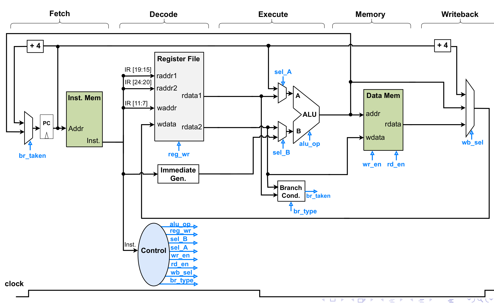
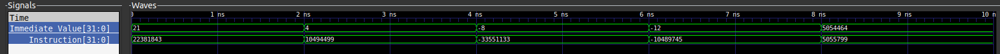

Author: Ali Imran

Registration: 2018-EE-062

**Table of Contents**
- [Single Cycle RISC-V Processor](#single-cycle-risc-v-processor)
  - [Data Path](#data-path)
    - [Register File](#register-file)
    - [Instruction Memory](#instruction-memory)
    - [Program Counter](#program-counter)
    - [Immediate Generator](#immediate-generator)
  
# Single Cycle RISC-V Processor
For this project, we are going to implement single cycle RISC-V processor as shown in figure below.
[label:abc]
For simulation, **cocotb** is used with **iverilog**.
## Data Path
### Register File
For register file we have the following code.
```verilog
module Register_File (
    output reg [31:0] rdata1, rdata2,
    output reg [31:0] x0,x1,x2,x3,x4,x5,x6,x7,x8,x9,x10,x11,x12,x13,x14,x15,x16,x17,x18,x19,x20,x21,x22,x23,x24,x25,x26,x27,x28,x29,x30,x31,
    input [4:0] raddr1, raddr2, waddr,
    input [31:0] wdata,
    input clk, rst, reg_wr
);
    integer i;
    reg [31:0] register_file [31:0];
    always @(posedge clk ) begin
        if(rst) begin
            for (i = 0; i <= 31; i=i+1) begin
                register_file[i] <= 0;
            end
        end else if(reg_wr) begin
            if(waddr != 0)
                register_file[waddr] <= wdata;
        end 
    end

    always @(*) begin
        rdata1 <= register_file[raddr1];
        rdata2 <= register_file[raddr2];
        x1 <= register_file[0];
        x2 <= register_file[1];
        x3 <= register_file[3];
        x4 <= register_file[4];
        x5 <= register_file[5];
        x6 <= register_file[6];
        x7 <= register_file[7];
        x8 <= register_file[8];
        x9 <= register_file[9];
        x10 <= register_file[10];
        x11 <= register_file[11];
        x12 <= register_file[12];
        x13 <= register_file[13];
        x14 <= register_file[14];
        x15 <= register_file[15];
        x16 <= register_file[16];
        x17 <= register_file[17];
        x18 <= register_file[18];
        x19 <= register_file[19];
        x20 <= register_file[20];
        x21 <= register_file[21];
        x22 <= register_file[22];
        x23 <= register_file[23];
        x24 <= register_file[24];
        x25 <= register_file[25];
        x26 <= register_file[26];
        x27 <= register_file[27];
        x28 <= register_file[28];
        x29 <= register_file[29];
        x30 <= register_file[30];
        x31 <= register_file[31];
    end

    initial begin
        $dumpfile("dump.vcd");
        $dumpvars;
    end
    
endmodule
```
Using the following test bench for register file.
```python
@cocotb.test()
async def Register_Test(dut):
    clk = Clock(dut.r1.clk,10,"ns")
    cocotb.fork(clk.start())
    await RisingEdge(dut.r1.clk)
    dut.r1.rst <= 1
    await RisingEdge(dut.r1.clk)
    dut.r1.rst <= 0
    await RisingEdge(dut.r1.clk)
    dut.r1.raddr1 <= 5
    dut.r1.reg_wr <= 1
    dut.r1.waddr <= 5
    dut.r1.wdata <= 10
    await RisingEdge(dut.r1.clk)
    dut.r1.reg_wr <= 0
    await RisingEdge(dut.r1.clk)
```
We get the following output wavefrom.


### Instruction Memory
For instruction memory we have the following code.
```verilog
module Instruction_Memory (
    output reg [31:0] Instruction,
    input [31:0] Address
);
    reg [31:0] instruction_memory [50:0];
    initial begin
     $readmemh("instruction_mem.mem",instruction_memory);
    end

    always @(*) begin
        Instruction <= instruction_memory[Address/4];
    end

    initial begin
        $dumpfile("dump.vcd");
        $dumpvars;
    end
    
endmodule
```

The instructions are being read from **instruction_mem.mem** file with following test contents.
```
00b58513
40b50533
00b55533
```

We have the following testbench.
```python
@cocotb.test()
async def Instruction_Test(dut):
    dut.i1.Address <= 8
    await Timer(2,'ns')
    dut.i1.Address <= 4
    await Timer(2,'ns')
    dut.i1.Address <= 0
    await Timer(2,'ns')
```
We get the following output wavefrom.


### Program Counter
For program counter we have the following code.
```verilog
module Program_Counter (
    input [31:0] ALU_out,
    input br_taken, clk, rst,
    output reg [31:0] PC
);
    always @(posedge clk ) begin
        if(rst)
            PC <= 0;
        else
            PC <= br_taken ? ALU_out : PC + 4;
    end
    
endmodule
```
We have the following testbench.
```python
@cocotb.test()
async def PC_Test(dut):
    clk = Clock(dut.p1.clk,10,"ns")
    cocotb.fork(clk.start())
    await RisingEdge(dut.p1.clk)
    dut.p1.ALU_out <= 10
    dut.p1.br_taken <= 0
    dut.p1.rst <= 1
    await RisingEdge(dut.p1.clk)
    dut.p1.rst <= 0
    await RisingEdge(dut.p1.clk)
    for i in range(2): await RisingEdge(dut.p1.clk)
    dut.p1.br_taken <= 1
    await RisingEdge(dut.p1.clk)
    dut.p1.br_taken <= 0
    for i in range(2): await RisingEdge(dut.p1.clk)
```
We get the following output wavefrom.


### Immediate Generator
We have the following verilog code.
```verilog
module Immediate_Generator (
    output reg [31:0] Immediate_Value,
    input [31:0] Instruction
);
    always_comb begin 
       // Using Opcode
        case (Instruction[6:0])
            // I Type Instruction
            7'd3,7'd19,7'd103: Immediate_Value <= {{20{Instruction[31]}}, Instruction[31:20]};
            // S Type Instruction
            7'd35: Immediate_Value <= {{20{Instruction[31]}}, Instruction[31:25], Instruction[11:7]};
            // B Type Instruction
            7'd99: Immediate_Value <= {{20{Instruction[31]}}, Instruction[7], Instruction[30:25], Instruction[11:8], 1'b0};
            // J Type Instruction
            7'd111: Immediate_Value <= {{12{Instruction[31]}}, Instruction[19:12], Instruction[20], Instruction[30:21], 1'b0};
            // U Type Instruction
            7'd23,7'd55: Immediate_Value <= {Instruction[31:12],12'b0};
            default: Immediate_Value <= 0;
        endcase
    end
endmodule
```
We have the following testbench.
```python
@cocotb.test()
async def Imm_Gen(dut):
    # addi x10,x11,21
    dut.ig.Instruction <= 22381843
    await Timer(2,'ns')
    # sw x10,4(x0)
    dut.ig.Instruction <= 10494499
    await Timer(2,'ns')
    # beq x0,x0,-8
    dut.ig.Instruction <= 4261416163
    await Timer(2,'ns')
    # jal x0,-12
    dut.ig.Instruction <= 4284477551
    await Timer(2,'ns')
    # lui x10,1234 = 5054464
    dut.ig.Instruction <= 5055799
    await Timer(2,'ns')
```
We get the following output waveform.



