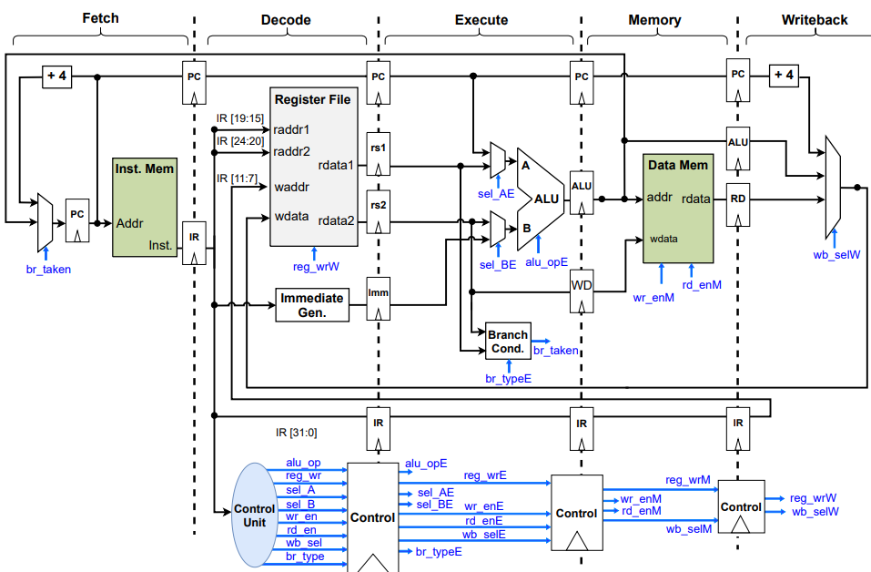
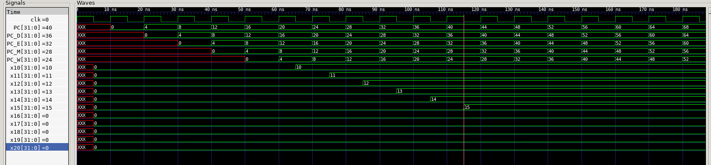
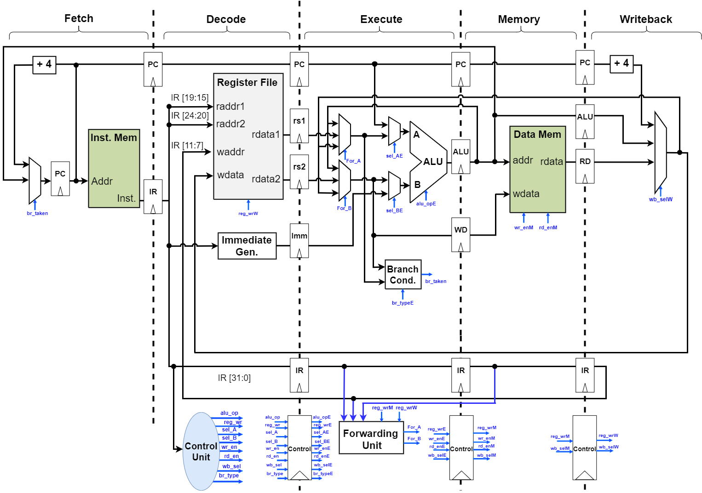
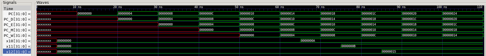
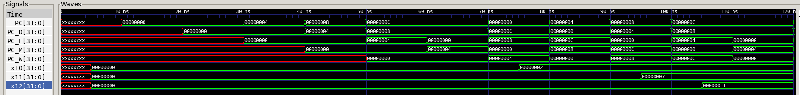

Author: Ali Imran

Registration: 2018-EE-062

- [Pipelined RISC-V Processor](#pipelined-risc-v-processor)
  - [Phase 1](#phase-1)
  - [Phase 2](#phase-2)
    - [Data Hazards](#data-hazards)
    - [Control Hazards](#control-hazards)
  - [CSR Support](#csr-support)

All the test are written in the **test.py** in **tests** directory. Run the makefile to start the simulation. 

# Pipelined RISC-V Processor
## Phase 1
For the first phase of this project, we are going to  converting our [Single Cycle Processor](../Single-Cycle) to the pipelined version as shown in figure below.


**Note:** This figure has been taken from the slides of Dr. Muhaamad Tahir.

For simulation, **cocotb** is used with **iverilog**.

For the five stages of the pipeline the four registers have been added which will not only propogate the inputs and outputs of each stage but will also propogate their control signals. The four registers have been added for the pipeline these registers are named as follows.

- [Decode Register](srcs/Decode.sv)
- [Execute Register](srcs/Execute.sv)
- [Memory Register](srcs/Memory.sv)
- [Writeback Register](srcs/Writeback.sv)

Following assembly code has been added in the **instruction_mem.mem** file to test the first phase of the pipeline.
```assembly
    addi x10,x0,10
    addi x11,x0,11
    addi x12,x0,12
    addi x13,x0,13
    addi x14,x0,14
    addi x15,x0,15
```
For the above code we have the following machine code.
```
00a00513
00b00593
00c00613
00d00693
00e00713
00f00793
```
We get the following output from our simulation.

## Phase 2
### Data Hazards
For phase 2, we are going to remove the data hazards first for which we are going to add the [Hhazard detection unit](srcs/forwarding_unit.sv). The forwarding unit compares the destination register of the previous and the second previous instruction with the source registers of the current instruction and forwards the ALU output from the memory and the writeback stage to the ALU inputs at the execution stage based on the comparison and the register write signals at the memory and writeback stage.



The forwarding unit implements the following conditions.
```verilog
if (rs1_E == rd_M && reg_wrM && rs1_E != 5'b0) 
    Forward ALU_out_M to A
else if (rs1_E == rd_W && reg_wrW && rs1_E != 5'b0) 
    Forward ALU_out_W to A

if (rs2_E == rd_M && reg_wrM && rs2_E != 5'b0)
    Forward ALU_out_M to B
else if (rs2_E == rd_W && reg_wrW && rs2_E != 5'b0) 
    Forward ALU_out_W to B

else
    Forward the register values
```

Following assembly code has been added in the **instruction_mem.mem** file for testing the forwarding of the pipeline.
```assembly
    addi x10,x0,10
    addi x11,x0,11
    add x12,x10,x11
```
For the above code we have the following machine code.
```
00000000
00a00513
00b00593
00b50633
```
We get the following output for the above assembly.



For the **lw** instruction, we need to stall the pipeline. We can identify the hazard by the `wb_selE` signal and we compare `rd_E` with `rs1_D` and `rs2_D`. We add stall signal to the Program Counter(Fetch Stage) and the Decode pipeline register. And the a Flush signal is added to the Execute pipeline register to clear the garbage values. 

For the **lw** stall, we implement the following conditions.
```verilog
if(wb_selE == 2'b10 && (rs1_D == rd_E || rs2_D == rd_E )) 
    StallF = 1;
    StallD = 1;
    FlushE = 1;
``` 

Following assembly code has been added in the **instruction_mem.mem** file for testing the stalling of the pipeline.
```assembly
    lw x10,0(x0)
    addi x11,x10,5
    addi x12,x11,10
```
For the above code we have the following machine code.
```
00000000
00002503
00550593
00a58613
```
We get the following output for the above assembly.


### Control Hazards
For the branch and jump hazards, we are going to flush the Decode and fetch stage incase the `br_taken` signal becomes true. We have the following condition.

```verilog
if(br_taken)
    FlushD = 1;
    FlushE = 1;
```

For this code, we are going to test the GCD assembly to test the hazards in out pipeline.
```assembly
    lw x8, 0(x0)
    lw x9, 4(x0)
gcd:
    beq x8, x9, stop
    blt x8, x9, less
    sub x8, x8, x9
    j gcd
less:
    sub x9, x9, x8
    j gcd
stop:
    sw x8,8(x0)
    lw x10,8(x0)
end:
    j end
 ```
For the above assembly, we have the following machine code in the **instruction_mem.mem**.
```machine
00000000
00002403
00402483
00940c63
00944663
409c0c33
ff5ff06f
408484b3
fedff06f
00802423
00802503
0000006f
```
We get the following waveform.


## CSR Support
Now for this part of the project we are going to add CSR instruction in our pipelined processor for this purpose we are going to support three new instructions which include `csrrs`, `csrrw` and `mret`. We are going to add CSR module in our pipeline.

Whenever an interrupt arrives the PC value at writeback stage is stored in `mepc` and the Decode, Execute and Writeback stages will be flushed after which the PC will be updated based on values of register `mtvec` and `mcause` when timer arrives the `mcause[30:0]` becomes 1 and the value of 'PC' will become `mtvec+ mcause[30:0] * 4` at that position the jump instruction to the handler will be available. So the handler will be executed then at the end we will return from handler to normal execution using `mret`. In this case on the execution of handler the x3 register values will be toggled.

```assembly
j main
j handler

main:
	addi x1,x1,1
end:
	nop
    j end

handler:
	xori x3,x3,0xFFFFFFFF
    mret
```
We have following machine code.

```
0080006f
0100006f
00108093
00000013
ffdff06f
fff1c193
00000073
```
