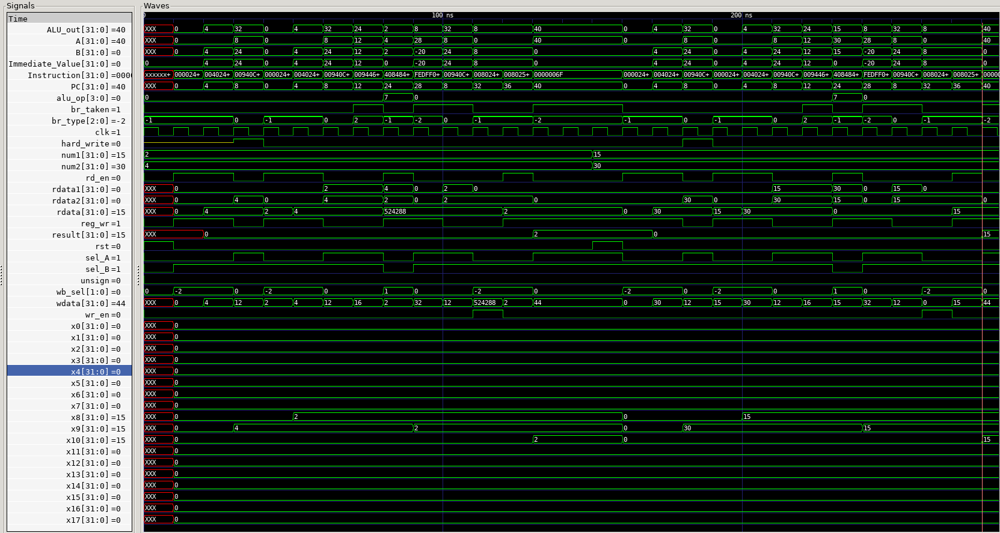

Author: Ali Imran

Registration: 2018-EE-062

**Table of Contents**
- [Single Cycle RISC-V Processor](#single-cycle-risc-v-processor)
  - [Top Module](#top-module)
  - [Data Path](#data-path)
    - [Register File](#register-file)
    - [Instruction Memory](#instruction-memory)
    - [Program Counter](#program-counter)
    - [Immediate Generator](#immediate-generator)
    - [ALU](#alu)
    - [Branch and Jump Module](#branch-and-jump-module)
    - [Data Memory](#data-memory)
  - [Controller](#controller)

**File Structure**

We have the following file structure. All the test are written in the **test.py** structure. Run the makefile to start the simulation. All the results are in the Figures directory. In order to run the simulation, [cocotb](https://github.com/cocotb/cocotb) and [iverilog](https://iverilog.fandom.com/wiki/Installation_Guide) is required to be installed. Run the simulation by running ```make``` command in the [tests](tests) folder in terminal to run the makefile which will perform the simulation using cocotb and dump the signals in the **dump.vcd** file. Vivado project is also available in the [Single Cycle Hardware](Single%20Cycle%20Hardware) folder which implements the processor on the FPGA board it takes the two inputs(`num1` and `num2`) from the user with switches and displays the output on the seven segment when the reset signal(`rst`) is set. The Vivado project also contains the simulation which is done using System Verilog. 
```bash
├── Figures
│   ├── ALU.png
│   ├── Branch.png
│   ├── Immediate_Generator.png
│   ├── Instruction.png
│   ├── PC.png
│   ├── Register.png
│   ├── ckt.png
│   ├── datamem.png
│   └── gcd.png
├── README.md
├── srcs
│   ├── ALU.sv
│   ├── Branch_Condition.sv
│   ├── Controller.sv
│   ├── Data_Memory.sv
│   ├── Immediate_Generator.sv
│   ├── Instruction_Memory.sv
│   ├── Program_Counter.sv
│   ├── Register_File.sv
│   ├── instruction_mem.mem
│   └── top.sv
└── tests
    ├── Makefile
    └── test.py
```

# Single Cycle RISC-V Processor
For this project, we are going to implement single cycle RISC-V processor as shown in figure below.

For simulation, **cocotb** is used with **iverilog**.

## Top Module
The [top module](srcs/top.sv) of our design takes two 5 bit numbers as the input and calculate their gcd. When the reset is set, the values are written to the data memory and then the assemblt instructions load those values to the register file and perform the calculations.

For testing the gcd code, following assembly has been created.
```assembly
    lw x8, 0(x0)
    lw x9, 4(x0)
gcd:
    beq x8, x9, stop
    blt x8, x9, less
    sub x8, x8, x9
    j gcd
less:
    sub x9, x9, x8
    j gcd
stop:
    sw x8,8(x0)
    lw x10,8(x0)
end:
    j end
 ```
For the above assembly, we have the following machine code in the **instruction_mem.mem**.
```machine
00000000
00002403
00402483
00940c63
00944663
409c0c33
ff5ff06f
408484b3
fedff06f
00802423
00802503
0000006f
```
For the top module, we have the following testbench.
```python
@cocotb.test()
async def gcd_Test(dut):
    clk = Clock(dut.clk,10,"ns")
    cocotb.fork(clk.start())
    await RisingEdge(dut.clk)
    dut.rst.value = 1
    dut.num1.value = 2
    dut.num2.value = 4
    await RisingEdge(dut.clk)
    dut.rst.value = 0
    await RisingEdge(dut.clk)
    await RisingEdge(dut.clk)
    dut.hard_write.value = 1
    await RisingEdge(dut.clk)
    dut.hard_write.value = 0
    for i in range(2): await RisingEdge(dut.clk)
    while(int(dut.PC) != 40): await RisingEdge(dut.clk)
    await RisingEdge(dut.clk)
    dut.rst.value = 1
    dut.num1.value = 15
    dut.num2.value = 30
    await RisingEdge(dut.clk)
    dut.rst.value = 0
    await RisingEdge(dut.clk)
    await RisingEdge(dut.clk)
    dut.hard_write.value = 1
    await RisingEdge(dut.clk)
    dut.hard_write.value = 0
    for i in range(2): await RisingEdge(dut.clk)
    while(int(dut.PC) != 40): await RisingEdge(dut.clk)
```
For the gcd code, we get the following results.

## Data Path
### Register File
For [register file](srcs/Register_File.sv), the data available at two specified addresses(```raddr1``` and ```addr2```) will be available at the output(```rdata1``` and ```rdata2```). And data(```wdata```) will be written at the specified address(```waddr```) when the register write control signal(```reg_wr```) is set. The 31 general purpose registers have been declared as the output for debugging purposes.

Using the following test bench for register file.
```python
@cocotb.test()
async def Register_Test(dut):
    clk = Clock(dut.r1.clk,10,"ns")
    cocotb.fork(clk.start())
    await RisingEdge(dut.r1.clk)
    dut.r1.rst <= 1
    await RisingEdge(dut.r1.clk)
    dut.r1.rst <= 0
    await RisingEdge(dut.r1.clk)
    dut.r1.raddr1 <= 5
    dut.r1.reg_wr <= 1
    dut.r1.waddr <= 5
    dut.r1.wdata <= 10
    await RisingEdge(dut.r1.clk)
    dut.r1.reg_wr <= 0
    await RisingEdge(dut.r1.clk)
```
We get the following output waveform.


### Instruction Memory
The [instruction memory](srcs/Instruction_Memory.sv) will read instructions from the [instruction_mem.mem](srcs/instruction_mem.mem) file. And the output(```Instruction```) will be available based on the instruction's address which is the input(```Address```).

The instructions are being read from **instruction_mem.mem** file with following test contents.
```
00b58513
40b50533
00b55533
```

We have the following testbench.
```python
@cocotb.test()
async def Instruction_Test(dut):
    dut.i1.Address <= 8
    await Timer(2,'ns')
    dut.i1.Address <= 4
    await Timer(2,'ns')
    dut.i1.Address <= 0
    await Timer(2,'ns')
```
We get the following output waveform.


### Program Counter
The [program counter](srcs/Program_Counter.sv) will provide the address(```PC```) of the instruction to be executed and the next value of the program counter will depend on the ```br_taken``` flag which decides whether the next instruction will be executed or we will jump to some other instruction.

We have the following testbench.
```python
@cocotb.test()
async def PC_Test(dut):
    clk = Clock(dut.p1.clk,10,"ns")
    cocotb.fork(clk.start())
    await RisingEdge(dut.p1.clk)
    dut.p1.ALU_out <= 10
    dut.p1.br_taken <= 0
    dut.p1.rst <= 1
    await RisingEdge(dut.p1.clk)
    dut.p1.rst <= 0
    await RisingEdge(dut.p1.clk)
    for i in range(2): await RisingEdge(dut.p1.clk)
    dut.p1.br_taken <= 1
    await RisingEdge(dut.p1.clk)
    dut.p1.br_taken <= 0
    for i in range(2): await RisingEdge(dut.p1.clk)
```
We get the following output waveform.


### Immediate Generator
The [Immediate Generator](srcs/Immediate_Generator.sv) will generate the ```Immediate Value``` based on the type of ```Instruction```.

We have the following testbench.
```python
@cocotb.test()
async def Imm_Gen(dut):
    # addi x10,x11,21
    dut.ig.Instruction <= 22381843
    await Timer(2,'ns')
    # sw x10,4(x0)
    dut.ig.Instruction <= 10494499
    await Timer(2,'ns')
    # beq x0,x0,-8
    dut.ig.Instruction <= 4261416163
    await Timer(2,'ns')
    # jal x0,-12
    dut.ig.Instruction <= 4284477551
    await Timer(2,'ns')
    # lui x10,1234 = 5054464
    dut.ig.Instruction <= 5055799
    await Timer(2,'ns')
```
We get the following output waveform.


### ALU
The [ALU](srcs/ALU.sv) will perform different operations on the two inputs(```A``` and ```B```) based on the control signal(`alu_op`).

Following is the testbench code.
```python
@cocotb.test()
async def alu(dut):
    dut.al.A <= 10
    dut.al.B <= 10
    dut.al.alu_op <= 3
    await Timer(2,'ns')
    dut.al.alu_op <= 0
    await Timer(2,'ns')
```
We get the following outputs for xor and add operations.


### Branch and Jump Module
The [Branch_Condition](srcs/Branch_Condition.sv) module performs different comparisons for the B-type based on the `br_type` control signal to generate the control signal(`br_taken`) for the B-type and J-type instructions which will be the input to the [Program_Counter](#program-counter) module.

We have the following testbench.
```python
@cocotb.test()
async def cond(dut):
    dut.bcond.A <= 10
    dut.bcond.B <= 10
    dut.bcond.br_type <= 0
    await Timer(2,'ns')
    dut.bcond.br_type <= 1
    await Timer(2,'ns')
    dut.bcond.br_type <= 6
    await Timer(2,'ns')
```
We get the following output waveform.


### Data Memory
The [Data_Memory](srcs/Data_Memory.sv) module creates the data memory from which data can be accessed or can be written onto based on the control signals(`wr_en` and `rd_en`).

We have the following testbench.
```python
@cocotb.test()
async def Data_Test(dut):
    clk = Clock(dut.dmem.clk,10,"ns")
    cocotb.fork(clk.start())
    await RisingEdge(dut.dmem.clk)
    dut.dmem.rst <= 1
    await RisingEdge(dut.dmem.clk)
    dut.dmem.rst <= 0
    await RisingEdge(dut.dmem.clk)
    dut.dmem.addr <= 10
    dut.dmem.wdata <= 100
    dut.dmem.wr_en <= 1
    await RisingEdge(dut.rf.clk)
    dut.dmem.wr_en <= 0
    await RisingEdge(dut.rf.clk)
    dut.dmem.rd_en <= 1
    await RisingEdge(dut.rf.clk)
    dut.dmem.rd_en <= 0
    await RisingEdge(dut.rf.clk)
```
We get the following output waveform.


## Controller
For this datapath, all the RV32I instructions have been implemented except for **lb**, **lh**, **lbu**, **lhu**, **sb** and **sh**. The [Controller](srcs/Controller.sv) generates different control signals(`alu_op, reg_wr, sel_A, sel_B, wr_en, rd_en, unsign, br_type, wb_sel`) for the different datapath modules based on the `Instruction` available at the input. 
